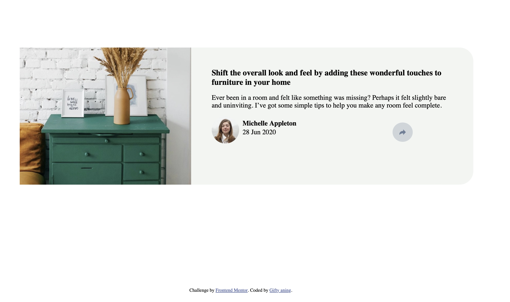

# Article-preview-component
This project is a solution to the Frontend Mentor | Article preview component challenge. It involves creating a responsive article preview card component that includes an image, an article description, and a share button that reveals social media sharing options on hover or click.

# Table of Contents
Links
Built With
Features
Usage
Project Structure
Acknowledgements
Contact

# Links
Solution URL: https://github.com/Giftyaning/Article-preview-component

Live Site URL: https://bucolic-nasturtium-f7f6ed.netlify.app

# Built With
HTML5
CSS3
JavaScript
Responsive Design
Flexbox

# Features
Responsive design for both desktop and mobile views.

Hover effects on share button to reveal social media icons.

Conditional display of share options based on screen size.

# Usage
Hover over the share button to display the social media sharing options on larger screens. On smaller screens, the component layout adjusts to a column format for better readability and usability.

# Acknowledgements
Challenge by Frontend Mentor
Design inspiration from the Frontend Mentor community.

# Contact
GitHub: @your-username
Frontend Mentor: @your-username
Email: Giftyaningg@gmail.com

Feel free to contribute to this project by creating issues or submitting pull requests. Any feedback is highly appreciated!